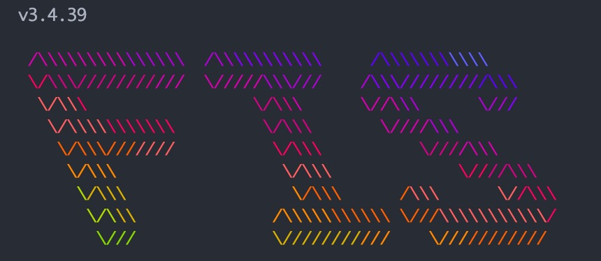

## 简介

基于`fis3`的多页开发脚手架，支持传统es6模块化（AMD）开发和vue2.x开发。

### 目录结构

    | - component 公共组件，这部分可以单独迁出业务项目（视情况而定）编译打包
    | - static 静态资源，包含非模块化的js
    | - widget 项目模块组件
    | - ...(其它目录结构视项目而定)

## 使用

**安装node**

node: 10.15.3

**全局安装fis3（注意版本）**

npm install fis3@3.4.39

**项目中安装依赖**

npm install

具体配置细节请参考[fis官网](http://fis.baidu.com/fis3/index.html)

### 开发环境

sh ./dev.sh

### 生产环境

sh ./prod.sh

### 语法检查

npm run lint